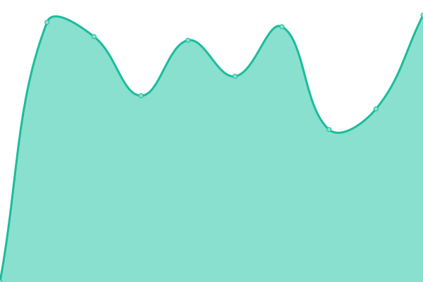
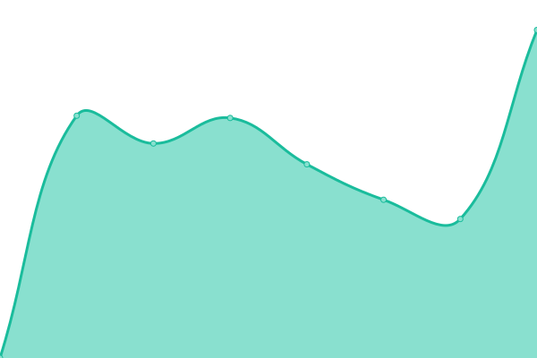
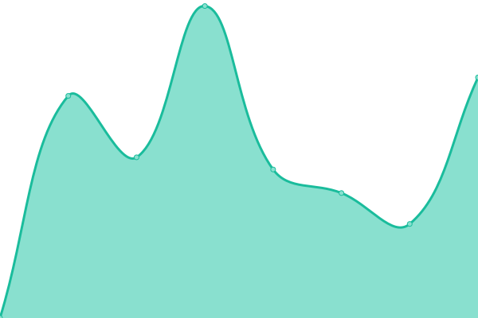
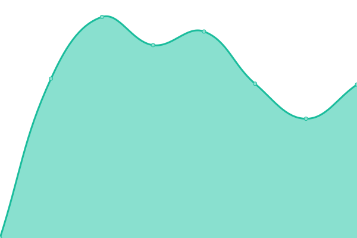

# [📈 Live Status](https://DamienCegos.github.io/upptime): <!--live status--> **🟩 All systems operational**

This repository contains the open-source uptime monitor and status page for [DamienCegos](https://DamienCegos.github.io/upptime), powered by [Upptime](https://github.com/upptime/upptime).

With [Upptime](https://upptime.js.org), you can get your own unlimited and free uptime monitor and status page, powered entirely by a GitHub repository. We use [Issues](https://github.com/DamienCegos/upptime/issues) as incident reports, [Actions](https://github.com/DamienCegos/upptime/actions) as uptime monitors, and [Pages](https://DamienCegos.github.io/upptime) for the status page.

<!--start: status pages-->
<!-- This summary is generated by Upptime (https://github.com/upptime/upptime) -->
<!-- Do not edit this manually, your changes will be overwritten -->
<!-- prettier-ignore -->
| URL | Status | History | Response Time | Uptime |
| --- | ------ | ------- | ------------- | ------ |
|  [www.cegos.fr](https://www.cegos.fr) | 🟩 Up | [www-cegos-fr.yml](https://github.com/DamienCegos/upptime/commits/HEAD/history/www-cegos-fr.yml) | 

 2819ms
     
 | 

<a href="https://DamienCegos.github.io/upptime/history/www-cegos-fr">100.00%</a>
    

|  [www.cegos.com](https://www.cegos.com/en) | 🟩 Up | [www-cegos-com.yml](https://github.com/DamienCegos/upptime/commits/HEAD/history/www-cegos-com.yml) | 

 2709ms
     
 | 

<a href="https://DamienCegos.github.io/upptime/history/www-cegos-com">99.96%</a>
    

|  [www.ib-formation.fr](https://www.ib-formation.fr) | 🟩 Up | [www-ib-formation-fr.yml](https://github.com/DamienCegos/upptime/commits/HEAD/history/www-ib-formation-fr.yml) | 

 4936ms
     
 | 

<a href="https://DamienCegos.github.io/upptime/history/www-ib-formation-fr">100.00%</a>
    

|  [www.integrata-cegos.de](https://www.integrata-cegos.de) | 🟩 Up | [www-integrata-cegos-de.yml](https://github.com/DamienCegos/upptime/commits/HEAD/history/www-integrata-cegos-de.yml) | 

 3350ms
     
 | 

<a href="https://DamienCegos.github.io/upptime/history/www-integrata-cegos-de">97.47%</a>
    

|  [www.cegos.it](https://www.cegos.it) | 🟩 Up | [www-cegos-it.yml](https://github.com/DamienCegos/upptime/commits/HEAD/history/www-cegos-it.yml) | 

 2134ms
     
 | 

<a href="https://DamienCegos.github.io/upptime/history/www-cegos-it">100.00%</a>
    

|  [www.cegos.es](https://www.cegos.es) | 🟩 Up | [www-cegos-es.yml](https://github.com/DamienCegos/upptime/commits/HEAD/history/www-cegos-es.yml) | 

 2652ms
     
 | 

<a href="https://DamienCegos.github.io/upptime/history/www-cegos-es">100.00%</a>
    

|  [www.cegoc.pt](https://www.cegoc.pt) | 🟩 Up | [www-cegoc-pt.yml](https://github.com/DamienCegos/upptime/commits/HEAD/history/www-cegoc-pt.yml) | 

 2229ms
     
 | 

<a href="https://DamienCegos.github.io/upptime/history/www-cegoc-pt">100.00%</a>
    

|  [www.cegos.ch](https://www.cegos.ch) | 🟩 Up | [www-cegos-ch.yml](https://github.com/DamienCegos/upptime/commits/HEAD/history/www-cegos-ch.yml) | 

 2107ms
     
 | 

<a href="https://DamienCegos.github.io/upptime/history/www-cegos-ch">100.00%</a>
    

|  [www.cegos.co.uk](https://www.cegos.co.uk) | 🟩 Up | [www-cegos-co-uk.yml](https://github.com/DamienCegos/upptime/commits/HEAD/history/www-cegos-co-uk.yml) | 

 2587ms
     
 | 

<a href="https://DamienCegos.github.io/upptime/history/www-cegos-co-uk">100.00%</a>
    

|  [www.cegos.com.sg](https://www.cegos.com.sg) | 🟩 Up | [www-cegos-com-sg.yml](https://github.com/DamienCegos/upptime/commits/HEAD/history/www-cegos-com-sg.yml) | 

 3615ms
     
 | 

<a href="https://DamienCegos.github.io/upptime/history/www-cegos-com-sg">100.00%</a>
    

|  [www.cegoslatam.com](https://www.cegoslatam.com) | 🟩 Up | [www-cegoslatam-com.yml](https://github.com/DamienCegos/upptime/commits/HEAD/history/www-cegoslatam-com.yml) | 

 2274ms
     
 | 

<a href="https://DamienCegos.github.io/upptime/history/www-cegoslatam-com">100.00%</a>
    

|  [www.cegos-channels-alliances.com](https://www.cegos-channels-alliances.com) | 🟩 Up | [www-cegos-channels-alliances-com.yml](https://github.com/DamienCegos/upptime/commits/HEAD/history/www-cegos-channels-alliances-com.yml) | 

 1693ms
     
 | 

<a href="https://DamienCegos.github.io/upptime/history/www-cegos-channels-alliances-com">100.00%</a>
    

|  [www.groupecimes.com](https://www.groupecimes.com) | 🟩 Up | [www-groupecimes-com.yml](https://github.com/DamienCegos/upptime/commits/HEAD/history/www-groupecimes-com.yml) | 

 2165ms
     
 | 

<a href="https://DamienCegos.github.io/upptime/history/www-groupecimes-com">100.00%</a>
    

<!--end: status pages-->

[**Visit our status website →**](https://DamienCegos.github.io/upptime)

## 📄 License

- Powered by: [Upptime](https://github.com/upptime/upptime)
- Code: [MIT](./LICENSE) © [DamienCegos](https://DamienCegos.github.io/upptime)
- Data in the `./history` directory: [Open Database License](https://opendatacommons.org/licenses/odbl/1-0/)
